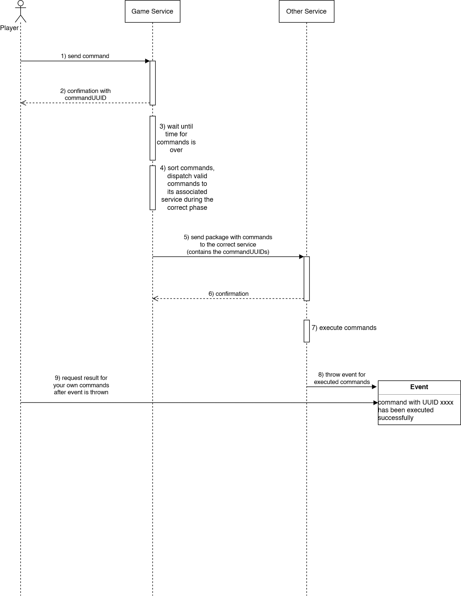

## Why is there need for such a decision?

Ownership for Command is claimed by more than one service: 
* Game
* Robot

## Additional sources for better understanding the background

n/a

## Viable Options

* Assign ownership
* Go for more than one command entity
* Generic command entity owned by Game, "payload" owned by services to whom command is routed

## Alternatives not seriously considered

tbd 

## How is this decision evaluated?

* discussion between game architects from game and robot service

## Resolution Details

* chosen option: "Generic command entity owned by Game, "payload" owned by services to whom command is routed"
* commands are owned by the Game Service
* Game Service receives commands from the players and is responsible for sorting them by their execution phase
* Game Service sends a package with commands to the associated service during the correct phase, the other service
executes the commands directly after receiving it (other services have no awareness about phases)
* commands are associated with a commandUUID, this UUID allows the player to access the result of their command after it
has been executed

## Reasons for the resolution

The whole project is API-driven, as the robot service will have to implement against the APIs. Therefore, the
APIs need to be done first.
