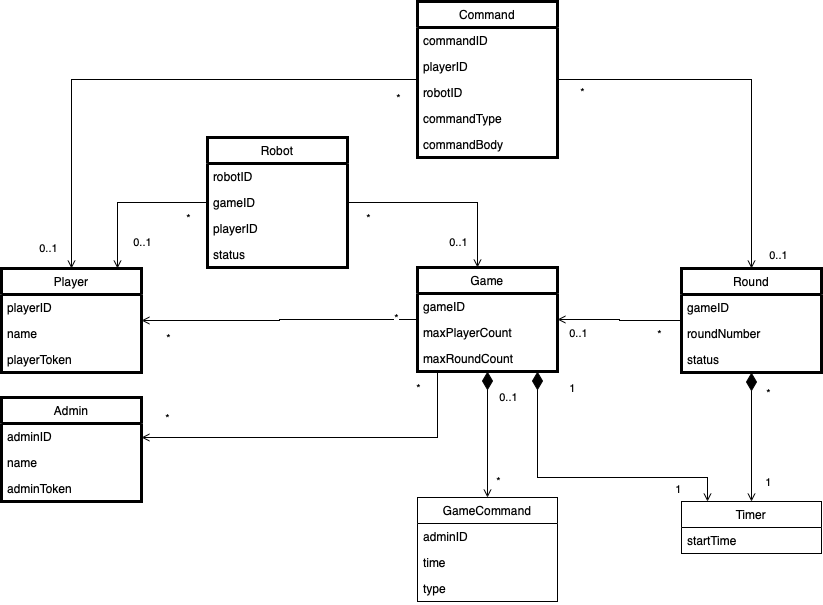

## Why is there need for such a decision?

The (sub-)domain model is a prerequisite for planning the development - which entities, value objects, aggregates 
do I have? 

In addition, it needs to be checked if the domain model is consistent with the other teams' (sub-)domain models.
Especially: Are there any conflicts with regard to entity ownership? There were some conflicts about the ownership of 
the commands which has resolved in decision domain-model-for-commands.

## Additional sources for better understanding the background

Evans, E. (2003). Domain-Driven Design: Tackling Complexity in the Heart of Software (1 edition). 
Addison-Wesley Professional.

## Viable Options

### Player
The Player gets commands which are executed in the game.

### Round
A Round follows certain conditions which are part of the Game. The conditions are initiated in the Round Phase...?
The timer is a composition of the round.

### Game
A Game follows certain conditions as max rounds an max players. The timer is a composition of the round.

    
### Command
Commands are executed through the Player in a Round. The command need the information about a certain Robot and which
phase or type is be chosen. For a detailed specification please read the domain-model-for-commands decision.

### Admin 
Admins are retired look decision game-admin-retired.

### Robot
The game manages a list of the robots from the players, to verify, that all the commands for the robots are from the right players.

### Further potential (sub) domains:
- Authentication

## Alternatives not seriously considered

n/a

## How is this decision evaluated?

Evaluation of [Event Storming results](https://miro.com/app/board/o9J_lsQV7ZA=/), and the discussion within the team.
 
## Resolution Details

tbd.

## Reasons for the resolution

tbd.
