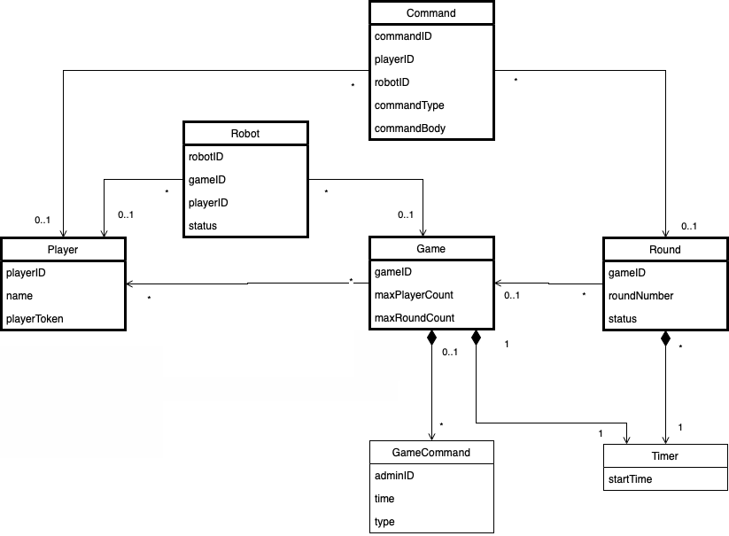

## Why is there need for such a decision?

This decision is the continuation of the game-domainmodel. In process of the project the model has changed throughout
the expired Admin which can be read in the admin_retired decision. 

## Additional sources for better understanding the background

Evans, E. (2003). Domain-Driven Design: Tackling Complexity in the Heart of Software (1 edition). 
Addison-Wesley Professional. 

## Viable Options

## Alternatives not seriously considered

n/a

## How is this decision evaluated?

Evaluation of [Event Storming results](https://miro.com/app/board/o9J_lsQV7ZA=/), and the discussion within the team.
 
## Resolution Details

For further Information read the previous decision concerning the data model.

## Reasons for the resolution

tbd.
