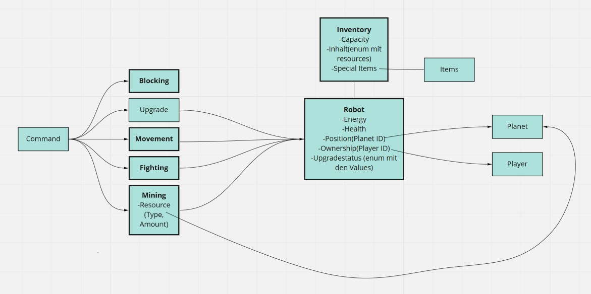

## Why is there need for such a decision?

The (sub-)domain model is a prerequisite for planning the development - which entities, value objects, aggregates 
do I have? 

In addition, it needs to be checked if the domain model is consistent with the other teams' (sub-)domain models.
Especially: Are there any conflicts with regard to entity ownership?

## Additional sources for better understanding the background

tbd.

## Viable Options

- movement: robot doesn't need the whole map, it just asks the map service if the received movement command is valid; robot also needs the feedback from the map which movement-difficulty the commanded move has
- upgrade status: robot receives the data from trading if upgrades are bought, stores this and tracks the multiplier (which is dependant on the total bought upgrades for each robot)
- inventory - resources: simple counter for each resource type which can be added/subtracted
- robot: health, attack power, energy, position (+ tiletype(spawn, spacestation, normal)), ownership of player, upgrade status, inventory (capacity, contents), special item holding

### Questions which must be clarified
1. spawn: is spawning part of the robot?
2. why is the connection between robot and trading missing in the overall concept? (should be there for upgrade / repair)
3. mining: is it part of robot or map? what can we expect from the map api? idea: map offers api which provides an answer if mining or movement ok is -> so that robot doesn't have to know the whole map 
4. mining: is this really part of robot? map should already handle the resource status of all planets, a simple notification to the robot inventory would suffice (if robot has to handle this he would have to do some requests to map and also update the values which the map holds)
5. who checks the authenticity? game service or everyone themselves?
6. who notifies the player when about which processed actions? (who throws events?)
7. blocking: who is responsible? is this part of robot because we are the only context which uses this info (for movement)? -> idea for blocking: we have own planet-objects which hold id + block status + tiletype(spawn, space station, normal) to easily manage the values we need, information will be gathered after successful movement (we then need the info from the map service there)
8. items: is the whole usage logic in the robot context because we are the ones who handle everything combat/movement related? therefore trading would just handle creation + transaction
9. is scouting dead? :)
10. who will issue which specific command? (from which context will these actions be commanded from?) -> Regenerate, Attack, Movement, Trading, Spawning Robots, Spawning Resources, Blocking
11. item usage: which is the specific order in which these will be activated? ("repair all robots on a planat" pre or post fighting? - as it is a fighting related item and should probably be used in this phase)
12. update of robot info: via events? is there a way to restrict readability of events with Apache Kafka?

## Alternatives not seriously considered

n/a

## How is this decision evaluated?

Evaluation of [Event Storming results](https://miro.com/app/board/o9J_lsQV7ZA=/), and the discussion within the team.
Afterwards a discussion with the architects was used to clarifiy the questions above.
 
## Resolution Details

tbd. - waiting for answers

## Reasons for the resolution

tbd.
