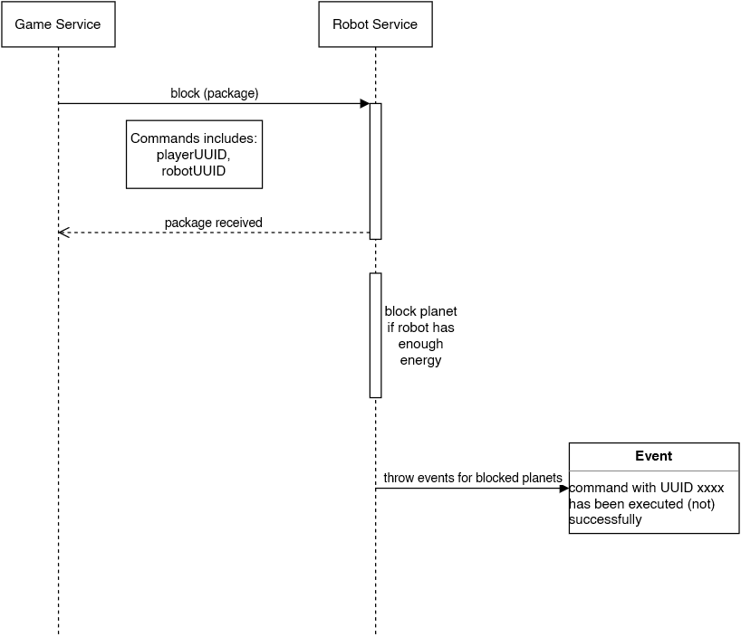

## Sequence diagram

## Contexts which interact with this sequence

* game service: issues the command which was received by the player  
* robot service: processes the command and throws event according to the result

## Additional information

No other service needs to know whether a planet is blocked or not so this information is managed within the robot context exclusively.

