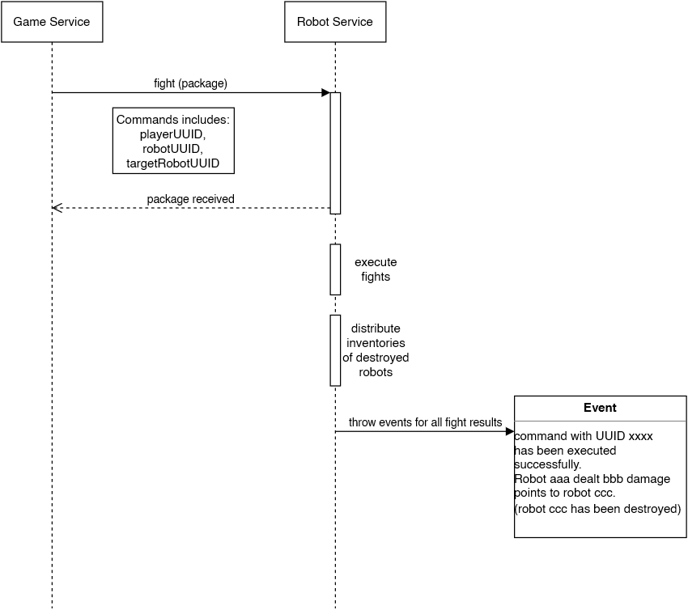

## Sequence diagram

  

## Contexts which interact with this sequence

* game service: issues the command which was received by the player  
* robot service: processes the command and throws event according to the result

## Additional information

The event which is thrown as a result of the fighting sequence is puplic available information, as long as someone knows the robot uuid he can listen and use the gathered information.  
Hiding the result behind a command uuid will obfuscate the information but results in problems for getting the needed information to the owner of the attacked robot (he doesn't know the command uuid and never will at the current draft of the command structure)