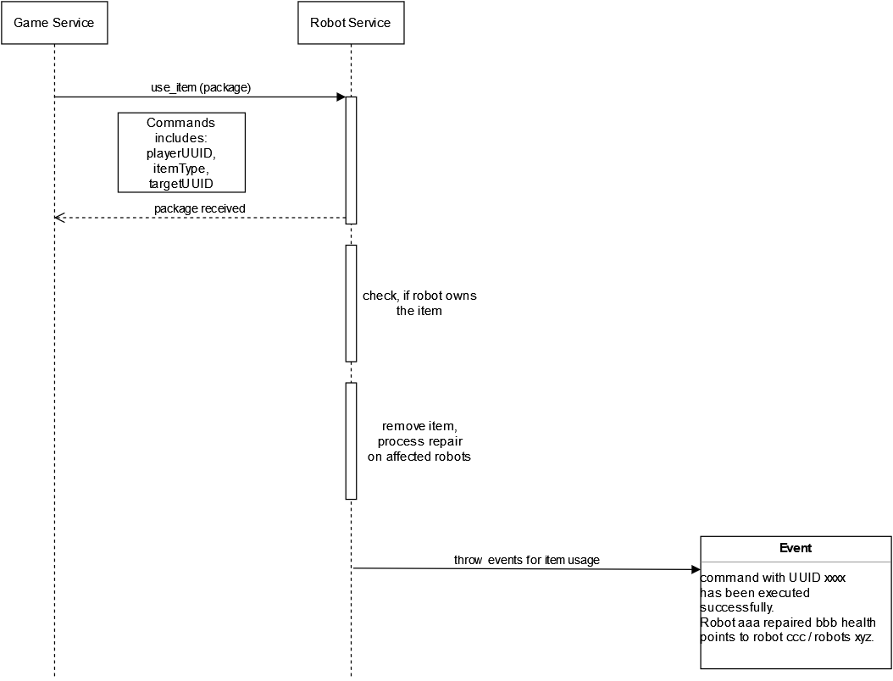

## Sequence diagram

### Fighting items

### Repair items

### Movement items

## Contexts which interact with this sequence

* game service: issues the command which was received by the player  
* robot service: processes the command, determines a random planet and throws events according to the result
* map service: provides a list of all planets

## Additional information

### Fighting item
The received item type determines if a robot uuid or a planet uuid is expected. E.g. robot uuid for the targeted rocket and planet uuid for the nuke.

### Repair item
The received item type determines if a robot uuid or a planet uuid is expected. E.g. robot uuid for a single repair and planet uuid for the repair swarm.

### Movement item (wormhole)
The robot service requests a list of all planets from the map service and chooses a random one. The location of the robot is changes accordingly and a success event is thrown. Additionaly, the two events after a successful movement (refer to [Robot movement sequence](./images/robot-movent-seq.png)) are also thrown.

## Problem with movement item (wormhole) - deprecated

This issue has been solved due to cutting the scope. (refer to [Decision: Obfuscation of information (fog of war)](./gameplay-obfuscation.md))  

After a successful move the player gets the new planet data obfuscated while not sending the planet uuid. Therefore the player can map the info with the help of the command uuid he got (he knows the planet uuid he sent his robot to so he can easily map). BUT: If movement happens with a randomized target planet the same method to obfuscate the planet info of the new planet doesn't work anymore because the event then has to contain the planet uuid to tell the player where this robot is. The solution would be to never tell the player which uuid a planet has, just giving him the info that there are neighbors "norht, east, south, west" and handling movement with that. (While considering this, don't forget about the validation done by the trading service whether a given planet uuid is a spacestation to check if trading in general is allowed - and other uses of the planet uuid)

