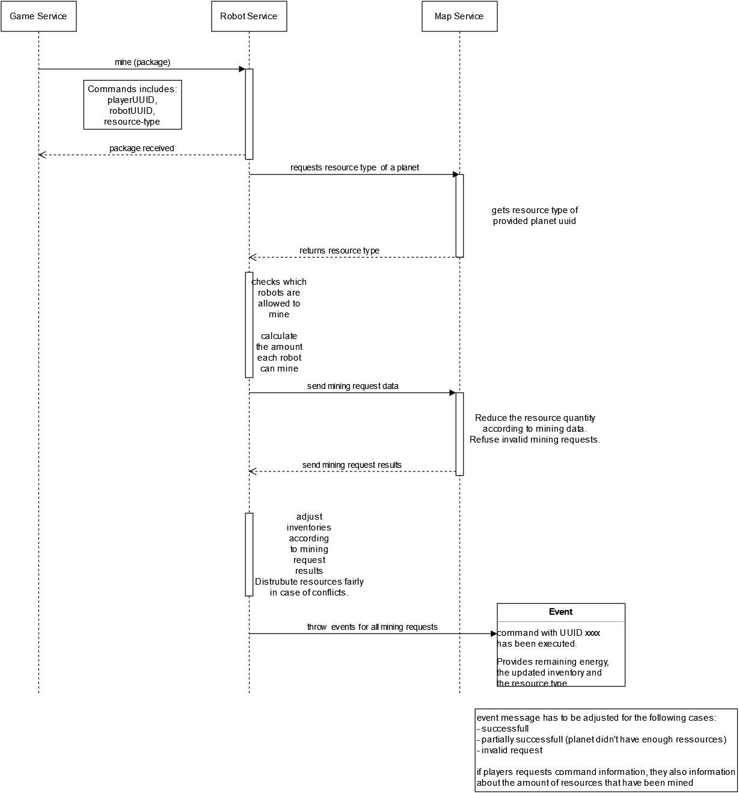

## Sequence diagram

## Contexts which interact with this sequence

game service: issues the command which was received by the player  
robot service: processes the command, issues requests to map, processes the results and throws event according to the result  
map service: handles the amount of resources available to all players

## Additional information

All mining requests issued to the map service have to be processed by them before sending the results back to the robot service.  
The player states which resource should be mined, so the robot service just checks if the specific robot is able to do that (mining level) and if yes, calculates the amount and requests that via the planet uuid on which the specific robot is at that moment

