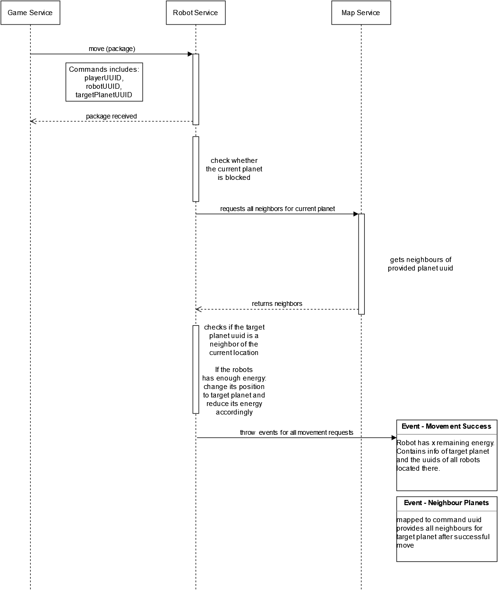

## Sequence diagram

## Contexts which interact with this sequence

* game service: issues the command which was received by the player  
* robot service: processes the command, issues requests to map, processes the results and throws event according to the result  
* map service: checks the validation of the move by providing info whether 2 planets are neighbors or not

## Additional information

A successful result of the move has to incluse all planet data of the new position. This info has to be obfuscated so that not every player can just read the most recent planet data of all visited planets. Therefore the planet info has to be obfuscated via the command uuid. The map doesn't know this uuid which means that robot has to forward the planet info.
If a player tries to move a robot which is on a blocked planet, the robot service will just throw an event to report the failure and that round is lost for that specific robot.