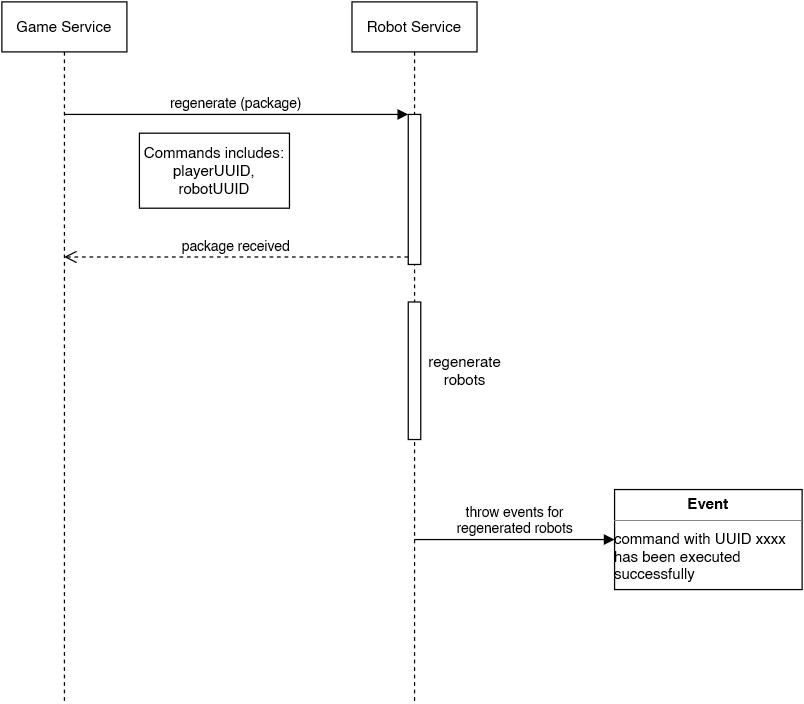

## Sequence diagram

## Contexts which interact with this sequence

game service: issues the command which was received by the player  
robot service: processes the command and throws event according to the result

## Additional information

Special case "regenerate twice the amount of energy on own spawn point" is probably out of scope because the robot service does not know the initial spawn location of the player - maybe there isn't one at all (game init: player has to buy his first robot and therefore has no designated personal spawn)

