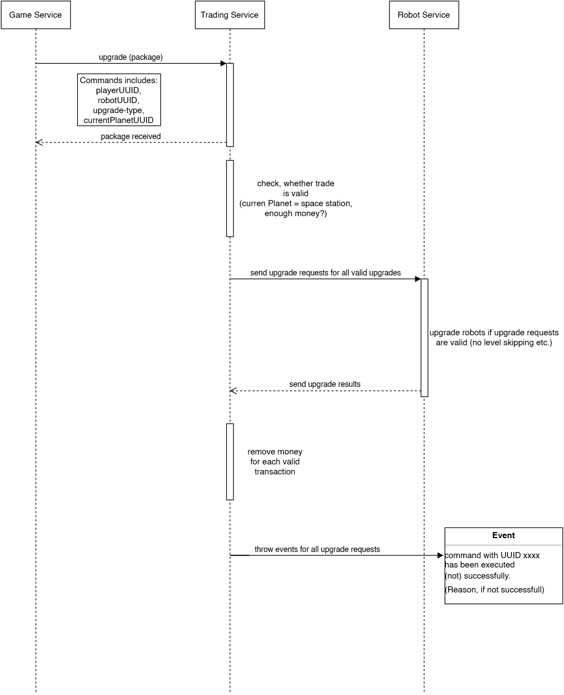

## Sequence diagram

## Contexts which interact with this sequence

game service: issues the command which was received by the player to the trading service  
trading service: processes the command, checks if position is a spacestation, checks if player has enough money, sends request to robot, receives answer from robot, adjusts wallet of player and throws success or failure event  
robot service: validate robot position and do the upgrade (answer is success or failure)

## Additional information

The trading service has to handle the communication with the game service and has to throw the events which report the results.  
The robot service only has to validate the position of the given robot and check if the bought upgrade is possible. If yes: do the upgrade and answer with success to the trading service and if no, answers with report of failure. The rest is handled by the trading service.