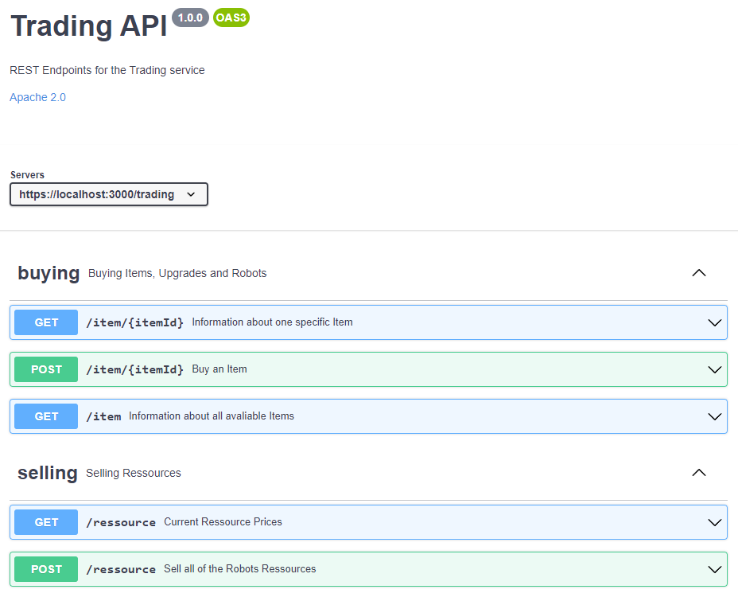

## Why is there need for such a decision?

This decision will serve as a kickoff for formally specifying the REST APIs.

## Additional sources for better understanding the background

https://netflixtechblog.com/optimizing-the-netflix-api-5c9ac715cf19
https://docs.microsoft.com/en-us/azure/architecture/antipatterns/chatty-io/

## Resolution Details


```openapi
openapi: 3.0.1
info:
  title: Trading API
  description: REST Endpoints for the Trading service
  license:
    name: Apache 2.0
    url: http://www.apache.org/licenses/LICENSE-2.0.html
  version: 1.0.0
servers:
- url: https://localhost:3000/trading
- url: http://localhost:3000/trading
tags:
- name: buying
  description: Buying Items, Upgrades and Robots
- name: selling
  description: Selling Ressources
paths:
  /item/{itemId}:
    get:
      tags:
      - buying
      summary: Information about one specific Item
      parameters:
      - name: itemId
        in: path
        description: ID of Item to buy
        required: true
        schema:
          type: integer
          format: int32
      responses:
        200:
          description: OK
          content:
            application/json:
              schema:
                $ref: '#/components/schemas/Item'
    post:
      tags:
      - buying
      summary: Buy an Item
      operationId: buyItem
      parameters:
      - name: itemId
        in: path
        description: ID of Item to buy
        required: true
        schema:
          type: integer
          format: int32
      requestBody:
        description: Information about the Robot, that sends the Command
        content:
          application/json:
            schema:
              $ref: '#/components/schemas/Robot'
        required: true
      responses:
        200:
          description: Command successful
          content: {}
        405:
          description: Invalid input
          content: {}
      x-codegen-request-body-name: robot
  /item:
    get:
      tags:
      - buying
      summary: Information about all avaliable Items
      responses:
        200:
          description: OK
          content:
            application/json:
              schema:
                type: array
                items:
                  $ref: '#/components/schemas/Item'
  /ressource:
    get:
      tags:
      - selling
      summary: Current Ressource Prices
      responses:
        200:
          description: OK
          content:
            application/json:
              schema:
                type: array
                items:
                  $ref: '#/components/schemas/Ressource'
    post:
      tags:
      - selling
      summary: Sell all of the Robots Ressources
      requestBody:
        description: Information about the Robot, that sends the Command
        content:
          application/json:
            schema:
              $ref: '#/components/schemas/Robot'
        required: true
      responses:
        200:
          description: Command successful - Ressources Sold
          content: 
            application/json:
              schema:
                type: number
                example: 200.12
        405:
          description: Invalid input
          content: {}
      x-codegen-request-body-name: robot
components:
  schemas:
    Item:
      type: object
      properties:
        id:
          type: string
          description: ID of the Item
          format: uuid
        name:
          type: string
          description: Name of the Item
          example: Rocket
        price:
          type: number
          description: Current Price of the Item
          format: double
          example: 200.2
        type:
          type: string
          example: item
          enum:
          - item
          - robot
          - upgrade
          - heath
          - energy
    Ressource:
      type: object
      properties:
        id:
          type: string
          description: ID of the Ressource
          format: uuid
        name:
          type: string
          description: Name of the Ressource
          example: Gold
        price:
          type: number
          description: Current Price of the Item per Unit
          format: double
          example: 200.2
    Robot:
      required:
      - playerId
      - robotId
      type: object
      properties:
        robotId:
          type: string
          description: ID of the Robot, that sends the Command
          format: uuid
        playerId:
          type: string
          description: ID of the Player, that sends the Command
          format: uuid
        planetId:
          type: string
          description: ID of the Planet, the Robot is standing on
          format: uuid

```

## Reasons for the resolution

From the set of all domain events modeled for the trading service that should be made accessible to the
the API, we selected the subset that could be directly traced to other services use cases. This subset was then used as the starting point for designing the API operations of the trading service. The goal was to expose more wide-grained or aggregated operations to the API, rather than publishing all of the fine-grained events.