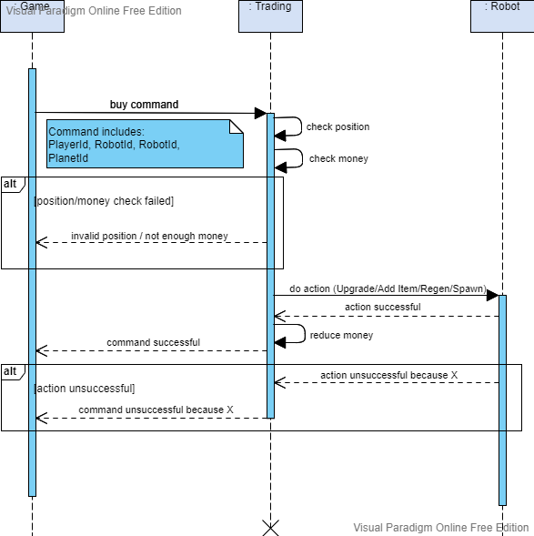
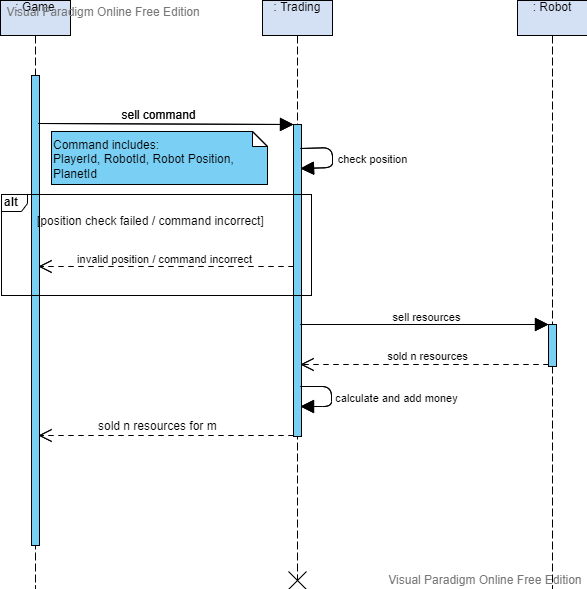
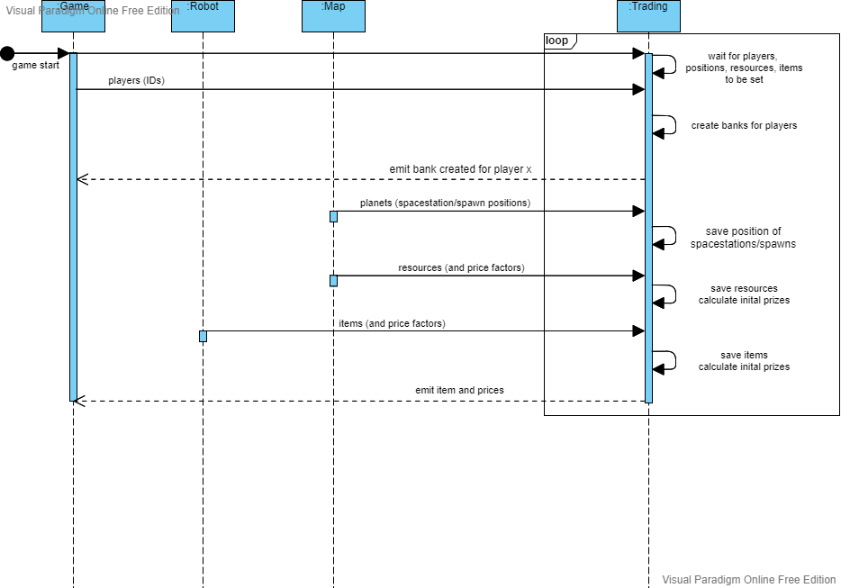

## Why is there need for such a decision?

To better understand how the trading service communicates with other services. And to have a model of all functions that need to be in the trading service.

## Additional sources for better understanding the background

tbd.

## Viable Options

### Buy Command

### Sell Command

### Initialize

## Alternatives not seriously considered

Treating trading as a sub-service from robot.
Have trading be the owner of items.

## How is this decision evaluated?

Discussion with team. Discussion with robot service and project lead.

## Resolution Details

Trading just checks position and money. Then requests the action from robot service. If robot responds with success, reduce money and confirm command. If robot responds with error, cancle command and emit error.

## Reasons for the resolution

Main discussed reason was to reduce the amount of communication between robot and trading service.